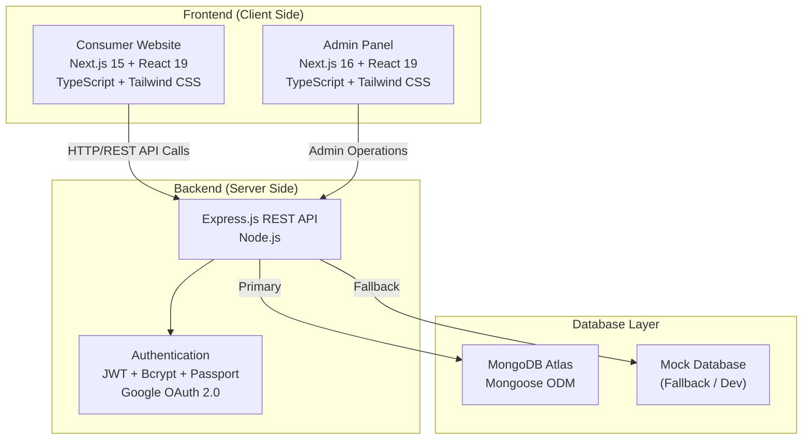
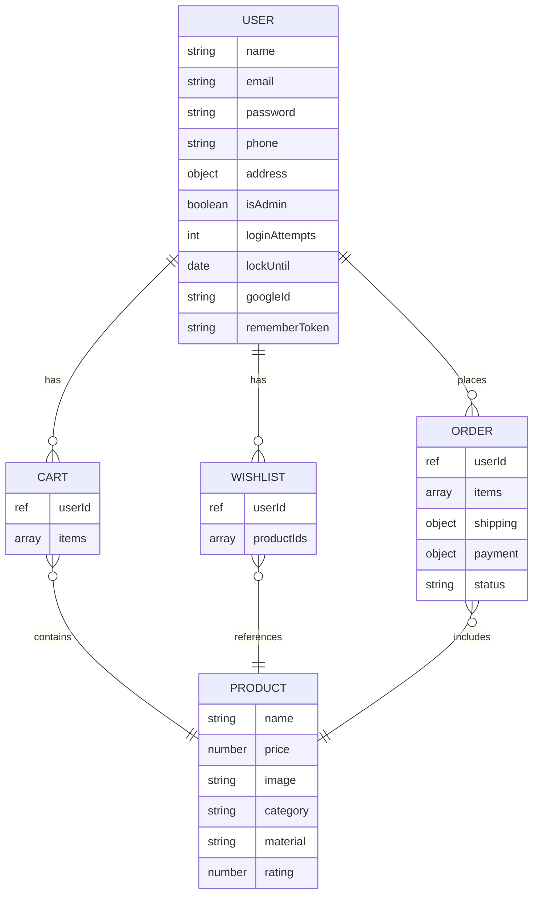
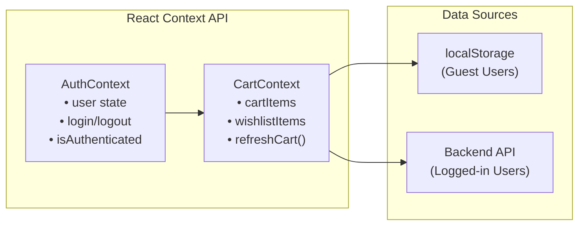

# 🏆 Gold Shop (Shiva Jewellers) — Interview Preparation Guide

---

## 1. Project Overview (Elevator Pitch)

> **"Gold Shop is a full-stack e-commerce platform built for a gold jewelry business (Shiva Jewellers). It has three main components: a consumer-facing storefront where customers can browse products, manage carts and wishlists, and buy digital gold; an admin panel for shop owners to manage inventory, billing, customers, and analytics; and a RESTful backend API powered by Node.js, Express, and MongoDB. The entire project is built with Next.js, React, TypeScript, and Tailwind CSS."**

Use this as your 30-second introduction when the interviewer says *"Tell me about your project."*

---

## 2. Architecture Overview



### Three-Tier Architecture

| Tier | Component | Location |
|------|-----------|----------|
| **Presentation** | Consumer Website | `consumer-website/` |
| **Presentation** | Admin Panel | `gold-shop-admin/` |
| **Business Logic** | REST API (Express.js) | `consumer-website/backend/` |
| **Data** | MongoDB Atlas + Mock DB | Cloud + In-Memory |

---

## 3. Technology Stack

### Frontend
| Technology | Version | Purpose |
|------------|---------|---------|
| **Next.js** | 15 (Consumer) / 16 (Admin) | React framework with SSR, routing, and optimization |
| **React** | 19 | UI component library |
| **TypeScript** | 5 | Type-safe JavaScript |
| **Tailwind CSS** | 4 | Utility-first CSS framework |
| **Framer Motion** | 11-12 | Smooth animations and page transitions |
| **Recharts** | 3 | Data visualization (charts in admin reports) |
| **Lucide React** | Latest | Icon library |

### Backend
| Technology | Purpose |
|------------|---------|
| **Node.js** | JavaScript runtime |
| **Express.js** | Web framework for REST API |
| **MongoDB + Mongoose** | NoSQL database + ODM |
| **JWT (jsonwebtoken)** | Stateless authentication tokens |
| **Bcrypt.js** | Password hashing (salt rounds = 10) |
| **Passport.js** | Authentication middleware (Google OAuth) |
| **Express-Session + connect-mongo** | Session management with MongoDB store |
| **CORS** | Cross-Origin Resource Sharing for frontend-backend communication |
| **dotenv** | Environment variable management |

### DevOps & Deployment
| Tool | Purpose |
|------|---------|
| **Netlify** | Frontend static site hosting |
| **Render / Railway** | Backend API hosting |
| **Firebase** | Alternative hosting option |
| **Vercel** | Alternative Next.js hosting |
| **GitHub Actions** | CI/CD pipeline (`.github/` directory present) |
| **Jest + ts-jest** | Unit testing framework |

---

## 4. Key Features Explained

### 4.1 Consumer Website Features

#### 🛒 Product Browsing & E-Commerce
- **Product Catalog**: 50+ jewelry items organized by category and material
- **Category Pages**: Gold, Silver, Diamond jewelry with subcategories
- **Collections Page**: Curated collections of jewelry
- **Search**: Full-text product search with filters
- **Product Detail Pages**: Detailed product info with images, price, and ratings

#### 🛍️ Cart & Wishlist System
- Works for **both authenticated and unauthenticated** users
- **Guest users**: Cart/Wishlist stored in `localStorage`
- **Logged-in users**: Data stored in MongoDB via API
- **Smart sync**: When a guest logs in, their localStorage cart is automatically synced to the database
- **Real-time updates**: Custom browser events (`cartUpdated`, `wishlistUpdated`) notify all components

#### 💰 Digital Gold Platform
- Buy/sell digital gold with real-time gold rates
- Transaction history tracking
- BIS hallmarked gold storage

#### 📋 Gold Scheme Interface
- Monthly installment savings plans
- Multiple scheme options with different durations
- Enrollment tracking and gold accumulation monitoring

#### 🔐 Authentication System
- **Email/Password Registration** with strong password validation:
  - Minimum 8 characters
  - Must include uppercase, lowercase, number, and special character
- **Google OAuth 2.0** login via Passport.js
- **JWT Token-based** authentication (30-day expiry)
- **Remember Me** functionality with crypto tokens
- **Account lockout** after 5 failed attempts (2-hour lock)
- **Token refresh** mechanism for seamless re-authentication

### 4.2 Admin Panel Features

| Module | Features |
|--------|----------|
| **Dashboard** | KPI overview (sales, orders, customers), recent activity feed, quick actions |
| **Inventory** | CRUD operations for products, stock levels, weight/purity tracking, low-stock alerts |
| **Billing** | Invoice generation, weight-based pricing, making charges, GST calculation, multi-payment support |
| **Customers** | Customer database, purchase history, membership tiers (Gold/Silver/Bronze) |
| **Reports** | Sales charts (Recharts), product distribution, top sellers, exportable reports |
| **Settings** | Shop info, security settings, notification preferences, payment config |

---

## 5. Database Design (MongoDB)

### Data Models



---

## 6. API Design (REST Endpoints)

| Resource | Method | Endpoint | Auth? | Description |
|----------|--------|----------|-------|-------------|
| **Auth** | POST | `/api/users/register` | ❌ | User registration |
| | POST | `/api/users/login` | ❌ | User login |
| | GET | `/api/users/profile` | ✅ | Get user profile |
| | PUT | `/api/users/profile` | ✅ | Update profile |
| | GET | `/api/users/auth/google` | ❌ | Google OAuth redirect |
| **Products** | GET | `/api/products` | ❌ | List all products |
| | GET | `/api/products/search` | ❌ | Search products |
| | GET | `/api/products/:id` | ❌ | Get product by ID |
| **Cart** | GET | `/api/cart` | ✅ | Get user's cart |
| | POST | `/api/cart/add` | ✅ | Add item to cart |
| | PUT | `/api/cart/update` | ✅ | Update quantity |
| | DELETE | `/api/cart/remove` | ✅ | Remove item |
| **Wishlist** | GET | `/api/wishlist` | ✅ | Get user's wishlist |
| | POST | `/api/wishlist/add` | ✅ | Add to wishlist |
| | POST | `/api/wishlist/move-to-cart` | ✅ | Move to cart |
| **Orders** | POST | `/api/orders` | ✅ | Create order |
| | GET | `/api/orders/myorders` | ✅ | Get order history |
| **Health** | GET | `/api/health` | ❌ | Server health check |

---

## 7. State Management Pattern



- **AuthContext**: Manages user authentication state, JWT tokens, and Google OAuth flow
- **CartContext**: Manages cart and wishlist with **dual-source strategy** (API for authenticated users, localStorage for guests)
- **Custom Events**: `userLoggedIn`, `cartUpdated`, `wishlistUpdated` events enable cross-component communication

---

## 8. Security Features

| Feature | Implementation |
|---------|----------------|
| Password Hashing | Bcrypt with salt rounds = 10 |
| Password Policy | Min 8 chars, uppercase, lowercase, digit, special char |
| Authentication | JWT tokens (30-day expiry) |
| Account Lockout | 5 failed attempts → 2-hour lock |
| CORS Whitelisting | Only allowed origins can make API calls |
| HTTP-Only Cookies | Session cookies not accessible via JavaScript |
| SameSite Cookies | `none` in production, `lax` in development |
| Input Validation | Mongoose schema validation + regex |
| Protected Routes | JWT middleware on sensitive endpoints |
| Google OAuth | Passport.js strategy with sparse unique index |

---

## 9. Deployment Architecture

```
┌──────────────────┐     ┌──────────────────┐     ┌──────────────────┐
│   Netlify CDN    │     │  Render/Railway   │     │  MongoDB Atlas   │
│                  │     │                   │     │                  │
│ Consumer Website │────▶│  Express.js API   │────▶│  Cloud Database  │
│  Admin Panel     │     │  (Node.js)        │     │                  │
│  (Static Build)  │     │                   │     │                  │
└──────────────────┘     └──────────────────┘     └──────────────────┘
```

---

## 10. 🎯 Likely Interview Questions & Answers

### General Project Questions

**Q1: What is this project about?**
> It's a full-stack e-commerce platform for a gold jewelry shop called "Shiva Jewellers." It has a consumer website for customers to browse and buy jewelry, an admin panel for shop management, and a RESTful backend API. Built with Next.js, React, TypeScript, Express.js, and MongoDB.

**Q2: What was your role in this project?**
> I was the full-stack developer. I designed the architecture, built the consumer frontend with Next.js and React, created the admin panel, developed the REST API with Express.js, designed the MongoDB database schema, and implemented the authentication system.

**Q3: How long did this project take?**
> *(Adjust based on your actual timeline)* The core development took approximately X weeks/months, with ongoing improvements for optimization and deployment.

---

### Architecture & Design Questions

**Q4: Why did you choose Next.js over plain React?**
> Next.js provides server-side rendering which improves SEO for product pages, file-based routing that simplifies the app structure, built-in API routes, image optimization, and Turbopack for fast development builds. For an e-commerce site, SEO is critical so SSR was a key requirement.

**Q5: Why MongoDB instead of MySQL/PostgreSQL?**
> MongoDB's flexible schema is ideal for e-commerce where product attributes vary by category (rings vs necklaces vs earrings have different attributes). JSON-like documents map naturally to JavaScript objects, and MongoDB Atlas provides easy cloud deployment with built-in replication.

**Q6: Explain your application architecture.**
> It follows a three-tier architecture:
> - **Presentation Tier**: Two Next.js apps (consumer + admin) that call the backend via REST APIs
> - **Logic Tier**: Express.js REST API with controllers, routes, and middleware for authentication
> - **Data Tier**: MongoDB Atlas with Mongoose ODM, plus a mock database fallback for development

**Q7: Why separate the admin panel into its own Next.js app?**
> Separation of concerns — the admin panel has different dependencies, security requirements, and deployment configurations. It can be deployed independently, and keeping it separate prevents admin-specific code from bloating the consumer bundle.

---

### Technical Questions

**Q8: How does your authentication system work?**
> Users register with email/password (hashed with bcrypt) or log in via Google OAuth (Passport.js strategy). On successful login, the server generates a JWT token valid for 30 days. The token is stored in localStorage and sent as a Bearer token in the Authorization header for protected API calls. The server validates the JWT using middleware before granting access.

**Q9: How do you handle cart for both guest and logged-in users?**
> Guest users' cart data is stored in `localStorage`. When they log in, `CartContext` triggers a sync function that reads localStorage items and pushes them to the MongoDB cart via API calls, then clears localStorage. From that point, all cart operations go through the API. This ensures a seamless experience without losing items.

**Q10: What is the React Context API and why did you use it instead of Redux?**
> React Context API is a built-in state management solution. I used `AuthContext` for authentication state and `CartContext` for cart/wishlist data. Since the state is relatively simple (user info, cart items, wishlist items), Context API is sufficient and avoids the boilerplate of Redux (actions, reducers, store setup). For a project of this scale, Redux would be overkill.

**Q11: How do you handle CORS in your backend?**
> I configured Express CORS middleware with a whitelist of allowed origins (Netlify domains, Render domain, localhost). The middleware checks the `Origin` header against the whitelist and rejects requests from unauthorized domains. I also handle preflight OPTIONS requests explicitly.

**Q12: What happens if MongoDB is down?**
> The backend has a graceful fallback — it detects MongoDB connection failures and automatically switches to an in-memory mock database with pre-seeded sample data. This ensures the application remains functional during development or temporary outages.

**Q13: How do you validate passwords?**
> Two levels: (1) Mongoose schema validation checks minimum length of 8 characters, (2) A pre-save middleware uses regex to enforce at least one uppercase letter, one lowercase letter, one digit, and one special character. Passwords are then hashed with bcrypt (10 salt rounds) before storage.

**Q14: What is JWT and how is it different from sessions?**
> JWT (JSON Web Token) is a self-contained, stateless token that contains encoded user information. Unlike sessions which store data on the server (requiring server memory/database lookups), JWTs are verified using a secret key without database queries. This makes them better for scalable APIs. However, I also use express-session with connect-mongo for Google OAuth flows.

**Q15: Explain the MVC pattern in your backend.**
> - **Models** (`models/`): Mongoose schemas defining data structure (User, Product, Cart, Wishlist, Order)
> - **Controllers** (`controllers/`): Business logic for each resource (CRUD operations, auth logic)
> - **Routes** (`routes/`): URL endpoint definitions that map HTTP methods to controller functions
> - **Views**: The React frontend acts as the view layer, consuming the API

---

### Frontend-Specific Questions

**Q16: What is the purpose of `'use client'` directive in your code?**
> In Next.js App Router, components are Server Components by default. The `'use client'` directive marks a component as a Client Component, meaning it runs in the browser and can use React hooks like `useState`, `useEffect`, event handlers, and browser APIs like `localStorage`.

**Q17: What are React Context Providers and how do you use them?**
> Providers wrap components and make data available to the entire component tree without prop drilling. My `AuthProvider` wraps the app and provides `user`, `login`, `logout`, and `isAuthenticated` state. `CartProvider` wraps components that need cart/wishlist data. Components consume this using `useAuth()` and `useCart()` custom hooks.

**Q18: How do you handle errors in the frontend?**
> I use `ErrorBoundary` components (React error boundaries) to catch rendering errors. For API calls, I use try-catch blocks with fallback behavior (e.g., falling back to localStorage if the API fails). The cart system has validation functions (`isValidCartItem`, `isValidWishlistItem`) that filter out malformed data.

**Q19: What animations did you implement?**
> I used Framer Motion for page transitions, hero carousel animations, and hover effects on product cards. The admin sidebar has CSS transition animations for the mobile slide-in/out effect.

---

### Database & API Questions

**Q20: How is your User schema designed for security?**
> The schema includes: `loginAttempts` counter, `lockUntil` timestamp (account locks after 5 failed attempts for 2 hours), `googleId` with sparse unique index (for OAuth users who don't have passwords), `rememberToken` with expiry for persistent login, and a pre-save hook that hashes passwords with bcrypt.

**Q21: What HTTP status codes do you use?**
> - `200`: Successful GET/PUT
> - `201`: Successful POST (resource created)
> - `400`: Bad request (validation errors)
> - `401`: Unauthorized (missing/invalid token)
> - `403`: Forbidden (insufficient permissions)
> - `404`: Resource not found
> - `500`: Internal server error

**Q22: What is Mongoose and why use it?**
> Mongoose is an ODM (Object Data Modeling) library for MongoDB. It provides schema validation, middleware hooks (pre-save for password hashing), built-in type casting, query building, and model methods. It adds structure to MongoDB's flexible documents while keeping the NoSQL advantages.

---

### Deployment & DevOps Questions

**Q23: How do you manage environment variables?**
> Sensitive data (MongoDB password, JWT secret, Google OAuth credentials) are stored in `.env` files, never committed to Git (via `.gitignore`). In production, these are set via the hosting platform's environment variable configuration (Render/Netlify dashboard). The app uses `dotenv` in Node.js and `NEXT_PUBLIC_` prefix for client-side variables in Next.js.

**Q24: How do you handle deployment of multiple services?**
> The consumer website and admin panel are deployed as static builds on Netlify (using `next build` + static export). The Express.js backend is deployed on Render/Railway with environment variables configured for the production MongoDB instance. CORS is configured to only allow the production frontend domains.

---

### Problem-Solving Questions

**Q25: What was the biggest challenge in this project?**
> The cart synchronization between guest and authenticated users was challenging. I had to handle multiple scenarios: guest adds items → logs in → items must sync to database without duplicates → future operations must go through API → if API fails, fall back gracefully to localStorage. I solved it with a dual-source strategy in CartContext and custom browser events.

**Q26: How would you scale this application?**
> - **Database**: MongoDB sharding for horizontal scaling, Redis caching for product catalog
> - **Backend**: Containerize with Docker, deploy on Kubernetes for auto-scaling
> - **Frontend**: CDN for static assets, ISR (Incremental Static Regeneration) in Next.js for product pages
> - **API**: Rate limiting, request queuing, microservices architecture for separating auth, products, and orders

**Q27: What would you improve if you had more time?**
> - Payment gateway integration (Razorpay/Stripe)
> - Real-time notifications with WebSockets
> - Image upload to cloud storage (S3/Cloudinary)
> - Server-side admin authentication (currently frontend-only demo)
> - Role-based access control (RBAC)
> - Comprehensive test coverage with integration tests
> - Redis caching layer for product data

---

## 11. Key Buzzwords to Use in Interview

| Buzzword | Where You Used It |
|----------|-------------------|
| **SSR (Server-Side Rendering)** | Next.js renders product pages server-side for SEO |
| **REST API** | Express.js backend follows REST conventions |
| **JWT Authentication** | Stateless token-based auth |
| **OAuth 2.0** | Google Sign-In via Passport.js |
| **MVC Architecture** | Models → Controllers → Routes in backend |
| **ODM (Mongoose)** | Object Data Modeling over MongoDB |
| **Context API** | React state management (AuthContext, CartContext) |
| **Responsive Design** | Tailwind CSS responsive breakpoints |
| **Error Boundaries** | React error handling pattern |
| **Graceful Degradation** | Mock database fallback when MongoDB unavailable |
| **CORS** | Cross-Origin security configuration |
| **Bcrypt Hashing** | Secure password storage |
| **Pre-save Hooks** | Mongoose middleware for password hashing |
| **Static Site Generation** | Next.js static export for deployment |
| **CI/CD** | GitHub Actions for automated deployment |

---

## 12. Quick Project Stats

| Metric | Value |
|--------|-------|
| **Total Components** | 14+ React components (Consumer) |
| **API Endpoints** | 16+ REST endpoints |
| **Database Models** | 5 (User, Product, Cart, Wishlist, Order) |
| **Frontend Pages** | 11+ pages (Consumer) + 7+ pages (Admin) |
| **Product Catalog** | 50+ sample jewelry items |
| **Authentication Methods** | 3 (Email/Password, Google OAuth, Remember Me) |
| **Deployment Targets** | Netlify + Render + MongoDB Atlas |

---

> [!TIP]
> **Practice saying these answers out loud** before your interview. The key is to sound confident and natural. Don't memorize word-for-word — understand the concepts and explain them in your own words.

> [!IMPORTANT]
> **Ask yourself**: For each feature you mention, can you explain *why* you chose that approach? Interviewers love hearing your reasoning, not just what you did.
